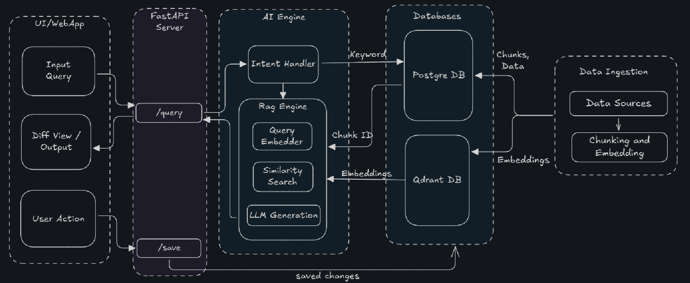

# Awesome Docify

Your AI assistant for painless documentation updates.

---

### Overview

Information changes fast, and keeping knowledge up to date is difficult. Companies need to keep their documentation accurate, but it's difficult for them to figure out all the places where they need to update information. This is the case each time there's a new product update. This tool is a solution to this problem. With this tool, you can:

1. Upload your documentation in json format.
2. Query the documentation with a natural language query.
3. The AI assistant returns the most relevant documents and the changes to the documents as a diff view on the web-app.
3. User can accecpt/reject/modify the changes.
4. User can then save those changes.

---

### Architecture



---

### Project Structure

```bash
awesome-docify/
├── fastapi_backend/        # Backend
├── nextjs-frontend/        # Frontend
├── local-shared-data/      # Local data
│   ├── docs/               # Input json files
│   └── qdrant/             # Vector database data
├── docs/                   # Documentation
├── .github/                # CI/CD
├── docker-compose.yml      # Docker compose file
├── Makefile                # Makefile
├── README.md               # This file
├── env.example             # Environment variables example
├── .pre-commit-config.yaml # Pre-commit config
├── .gitignore              # Git ignore rules
└── LICENSE.txt             # License
```

Refer [fastapi_backend/README.md](fastapi_backend/README.md) and [nextjs-frontend/README.md](nextjs-frontend/README.md) for tech stack and file structure.

---

### Prerequisites

See [docs/prerequisites.md](docs/prerequisites.md).

---

### Getting Started

#### 1. Clone the repository
```bash
git clone https://github.com/AnishNavalgund/awesome-docify.git
cd awesome-docify
```

#### 2. Save the input documents and make a directory for the qdrant database

Recommendation: `local-shared-data/docs` for jsons and `local-shared-data/qdrant` for the qdrant database. If changed, update CI workflow to use the new directories.

#### 3. Configure Environment Variables

Create a `.env` file in the root directory and fill in the required environment variables by refering to `.env.example`

#### 4. Start the application

#### **Option A: Using Docker**

```bash
docker compose up -d
```
Note: The backend will take a while to start up. Please observe the logs to ensure the backend application is ready.

---

#### **Option B: Local Development**

##### B1. Install dependencies (backend + frontend)

```bash
cd fastapi_backend && uv sync && cd ../nextjs-frontend && pnpm install
```

##### B2. Source the environment

```bash
cd fastapi_backend && source .venv/bin/activate
```
##### B3. Pre-commit hooks

```bash
pre-commit install
```

##### B4. Start the Postgres database

```bash
docker compose up -d db
```

##### B5. Start the application

```bash
cd fastapi_backend && uv run uvicorn app.main:app --host 0.0.0.0 --port 8000
```

in another terminal, start the frontend

```bash
cd nextjs-frontend && npm run dev
```

##### B6. Access the application

- **Frontend**: http://localhost:3000
- **Backend API**: http://localhost:8000

---

### API Documentation

See [docs/api_documentation.md](docs/api_documentation.md). or, access the API documentation at http://localhost:8000/docs after running the backend.

---

### Available Makefile Commands

See [docs/make_commands.md](docs/make_commands.md).

---

### Example Test Queries
1. "the function run_demo_loop will be changed to run_demo_in_loop"
2. "MCPToolApprovalFunction  will be removed"
3. "A new exception "ModelCallError" will be supported "

---

### Limitations
The MVP was designed giving importance to LLM cost, speed and the overall backend development. It works well for simple ADD/MODIFY/DELETE updates demonstrating the technology. It struggles with complex queries and cross-document relationships. This can be further optimized.

---

### License

This project is open source and available under the [MIT License](LICENSE.txt).

---
